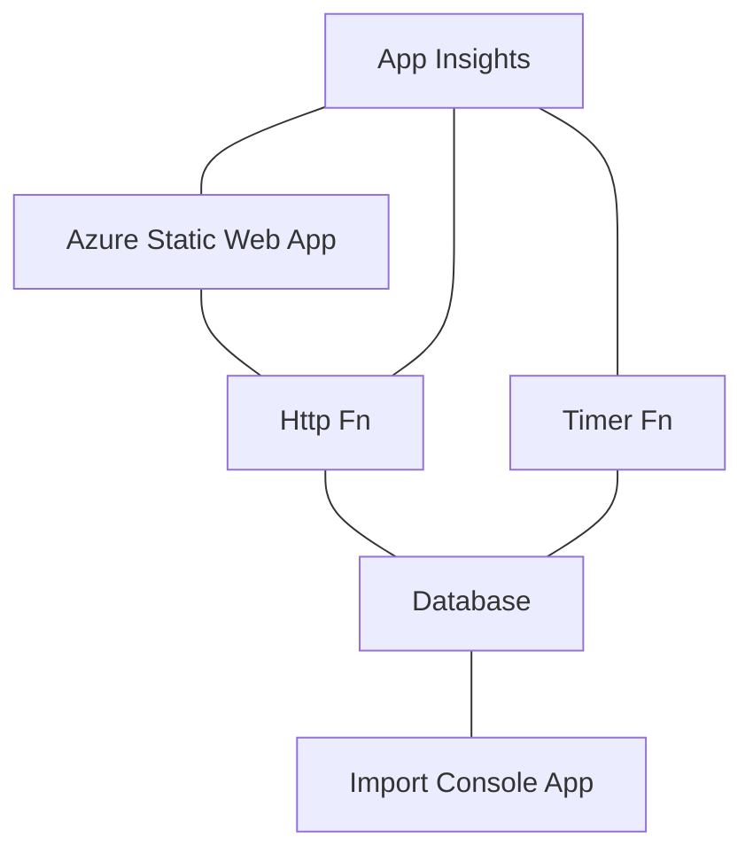

+++
title = "Diagrams with Mermaid"
date = "2022-06-19T18:00:45Z"
year = "2022"
month= "2022-06"
author = "funkysi1701"
authorTwitter = "funkysi1701" #do not include @
cover = "/images/mermaid2.png"
images = ['/images/mermaid2.png']
tags = ["github", "programming", "mermaid", "documentation"]
category="tech"
description =  "Mermaid is a tool that lets you create diagrams from code and text"
summary = "Mermaid is a tool that lets you create diagrams from code and text"
showFullContent = false
readingTime = true
copyright = false
featured = false
aliases = [
    "/diagrams-with-mermaid-1d41",
    "/posts/diagrams",
    "/posts/2022/06/14/diagrams",
    "/posts/diagrams-with-mermaid-1d41",
    "/posts/2022/06/14/diagrams-with-mermaid-1d41",
    "/2022/06/14/diagrams-with-mermaid-1d41"    
]
+++
I have been wanting to produce a diagram of the architecture of my side project for some time, but I have put it off as never sure what the correct tools is for this job.

[Mermaid](http://mermaid-js.github.io/mermaid/#/) is a tool that lets you create diagrams from code and text. I first came across this tool about a year ago for use in a project. I had forgotten about this tool until the other day, when I was thinking about this problem again.

Is it possible to embed a mermaid diagram in the markdown used in a github repo? Well the answer is yes, so lets look at how that works.

A simple mermaid diagram looks like this:

```
graph TD;
    A[fff]--->B;
    A--->C;
    B--->D;
    C--->D;
```

which renders like this:


Lets look at what it is doing.

TD means the chart is top down.

A is the name of a node in the chart, [fff] is a label being applied to it.

Then we just define the relationships between the different nodes, you can have <---, ---> or ---, or even<br/> <--->

Lets look at my architecture. I have a database (cosmosDB), I have a website running on Azure Static Web Apps, I have some Azure functions for getting data into and out of my database. I also have Application Insights monitoring the whole thing. I also have a console app for doing some data import stuff. This produces a diagram like this:


The code to produce this and display it on my [github repo](https://github.com/funkysi1701/Blogv2/) is simply

```


Pretty nice for a few lines of code to show what system talks with what. 

There are improvements that can be made to the diagram, for example changing the shapes of the different services.

eg 

What diagrams are you going to build?